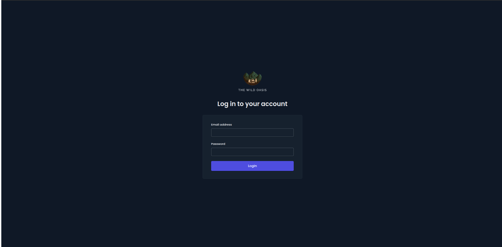
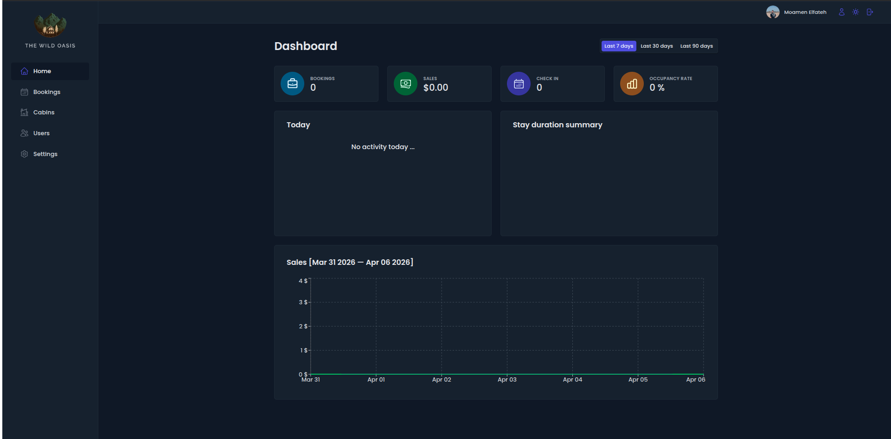
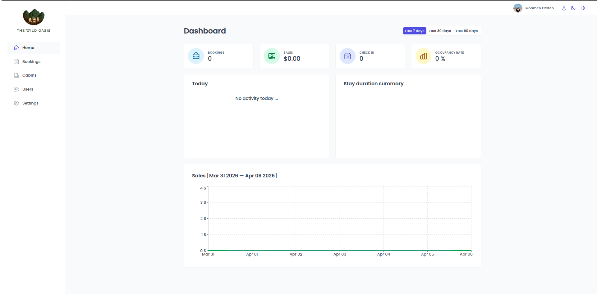
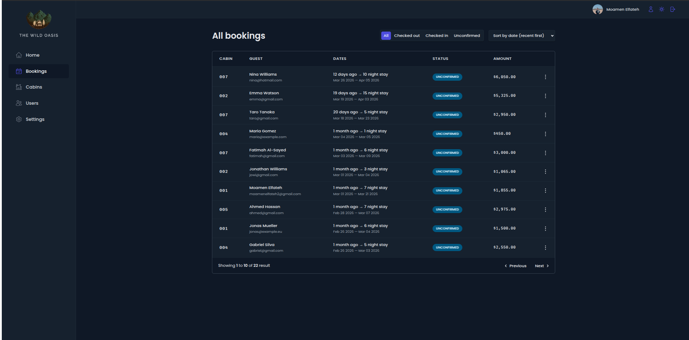
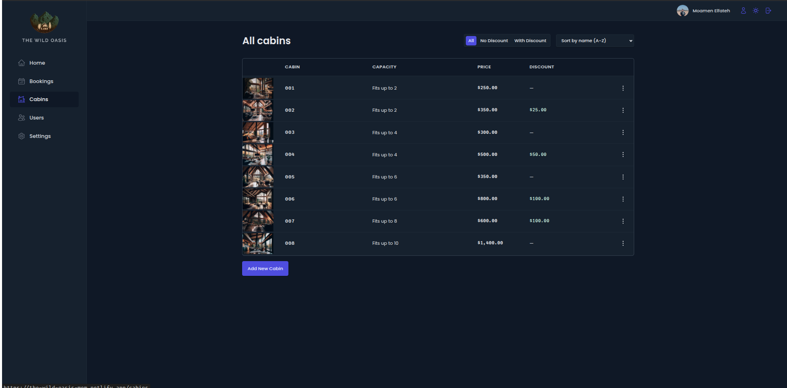
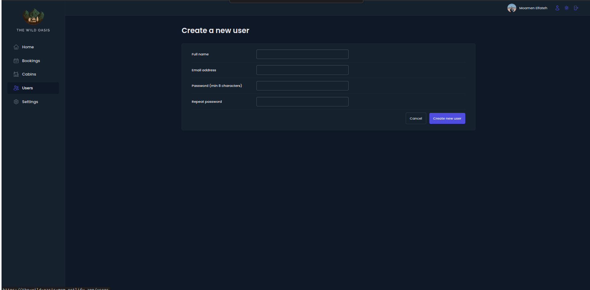
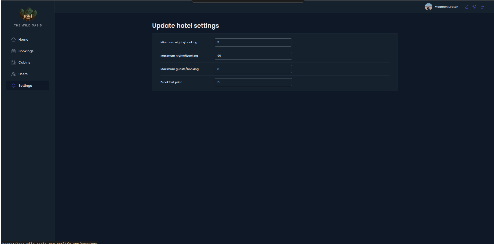

# 🏕️ The Wild Oasis — Hotel Management Dashboard

> A full-featured internal hotel management system built for staff to streamline operations — from bookings to cabin management, analytics, and user administration.

---

## 📸 Screenshots

### 🔐 Login

<p align="center">
  
</p>

---

### 📊 Dashboard — Dark Mode

<p align="center">
  
</p>

---

### 🌗 Dashboard — Light Mode

<p align="center">
  
</p>

---

### 📅 Bookings

<p align="center">
  
</p>

---

### 🛖 Cabins

<p align="center">
  
</p>

---

### 👥 Users

<p align="center">
  
</p>

---

### ⚙️ Settings

<p align="center">
  
</p>

---

## 📌 Overview

**The Wild Oasis** is a professional-grade internal web application designed for hotel employees to manage day-to-day operations through an intuitive, responsive dashboard. It features real-time data powered by Supabase, a polished dark/light UI, and comprehensive management tools across bookings, cabins, users, and hotel settings.

---

## ✨ Features

### 🔐 Authentication

- Secure staff login via email & password
- Protected routes — only authenticated users can access the dashboard
- Create new staff accounts from within the app

### 📊 Dashboard & Analytics

- KPI cards: **Bookings**, **Sales**, **Check-ins**, **Occupancy Rate**
- Time-range filters: Last **7**, **30**, or **90** days
- **Sales line chart** with date-range labeling (powered by Recharts)
- **Stay duration summary** widget
- **Today's activity** feed (check-ins / check-outs)

### 📅 Bookings Management

- Full bookings table with: Cabin, Guest, Dates, Status, Amount
- Filter by status: **All** / **Checked Out** / **Checked In** / **Unconfirmed**
- Sort by date (recent first / oldest first)
- Pagination — 10 bookings per page
- Inline actions menu per booking (edit, delete, check-in)

### 🛖 Cabins Management

- View all cabins with photos, capacity, price, and discount
- Filter: **All** / **No Discount** / **With Discount**
- Sort by name or price
- Add new cabins with photo upload
- Edit or delete existing cabins

### 👥 User Management

- Create new hotel staff accounts (name, email, password)
- Managed through Supabase Authentication

### ⚙️ Hotel Settings

- Configure hotel-wide rules:
  - Minimum & maximum nights per booking
  - Maximum guests per booking
  - Breakfast price

### 🌗 Dark / Light Mode

- Full theme toggle with persistent preference

---

## 🛠️ Tech Stack

| Category       | Technology                         |
| -------------- | ---------------------------------- |
| Framework      | React 18                           |
| Build Tool     | Vite                               |
| Routing        | React Router DOM v6                |
| Server State   | TanStack React Query v4            |
| Backend / DB   | Supabase (Auth, Database, Storage) |
| Styling        | Styled Components v6               |
| Forms          | React Hook Form                    |
| Charts         | Recharts                           |
| Notifications  | React Hot Toast                    |
| Icons          | React Icons                        |
| Date Utilities | date-fns                           |
| Error Handling | React Error Boundary               |

---

## 🚀 Getting Started

### Prerequisites

- Node.js ≥ 18
- A [Supabase](https://supabase.com) project with the required tables set up

### Installation

```bash
# Clone the repository
git clone https://github.com/MoamenElfateh/the-wild-oasis.git

# Navigate into the project
cd the-wild-oasis

# Install dependencies
npm install
```

### Environment Variables

Create a `.env` file in the root directory:

```env
VITE_SUPABASE_URL=your_supabase_project_url
VITE_SUPABASE_ANON_KEY=your_supabase_anon_key
```

### Running the App

```bash
# Start development server
npm run dev

# Build for production
npm run build

# Preview production build
npm run preview
```

---

## 📁 Project Structure

```
src/
├── features/
│   ├── authentication/   # Login, user creation, auth hooks
│   ├── bookings/         # Booking table, filters, detail view
│   ├── cabins/           # Cabin list, form, CRUD operations
│   ├── dashboard/        # Stats, charts, activity feed
│   └── settings/         # Hotel settings form
├── pages/                # Route-level page components
├── services/             # Supabase API calls
├── hooks/                # Shared custom hooks
├── ui/                   # Reusable UI components
├── context/              # Dark mode context
└── utils/                # Helper functions
```

---

## 👨‍💻 Author

**Moamen Mohamed Elfateh**

- 📧 moamenelfateh2@gmail.com
- 🔗 [LinkedIn](https://linkedin.com/in/moamen-mohamed-elfateh)
- 🐙 [GitHub](https://github.com/MoamenElfateh)
- 📍 Suez, Egypt

---

## 📄 License

This project is for educational and portfolio purposes.
